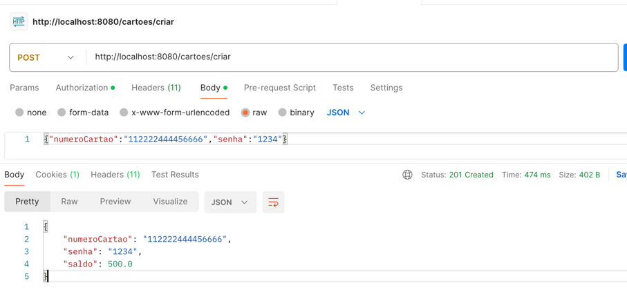
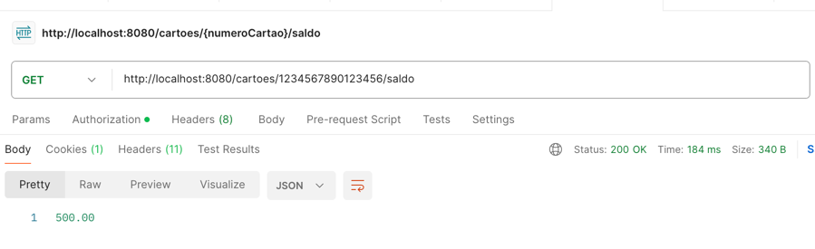
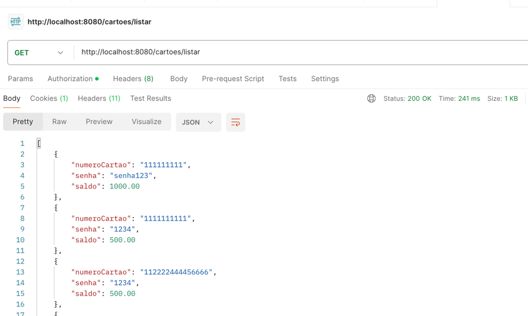
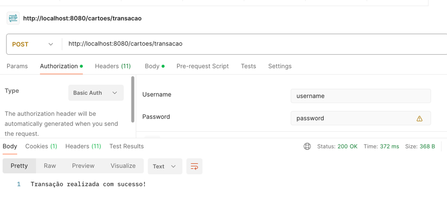
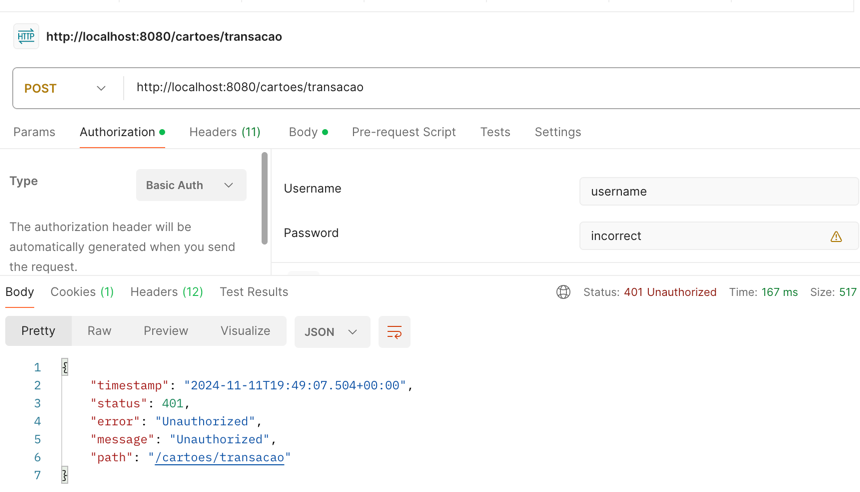

# Mini Autorizador

Este projeto é uma API que simula a funcionalidade de um sistema de autorização de cartões de crédito/débito. Foi desenvolvido utilizando Java 17, Spring Boot, Spring Security, Hibernate, Spring Data e MySQL. A seguir, apresento os detalhes da aplicação, como funciona, os endpoints disponíveis e exemplos de entradas e saídas.

## Tecnologias Utilizadas

- **Java 17**
- **Spring Boot**
- **Spring Security** (para validação de segurança)
- **Spring Data JPA** (para integração com banco de dados)
- **Hibernate** (para persistência de dados)
- **MySQL** (para armazenamento de dados)
- **Docker** (para containerização do MySQL)

## Endpoints da API

### 1. **Criar Cartão**
- **Método**: POST
- **URL**: `/cartoes/criar`
- **Descrição**: Cria um novo cartão com saldo inicial de R$ 500,00.

#### Entrada:
```json
{
    "numeroCartao": "1234567890123456",
    "senha": "1234"
}
```
#### Saída Esperada:
- **Código de Status**: 201 (Created)
- **Corpo da Resposta**:
```json
{
    "numeroCartao": "1234567890123456",
    "senha": "1234",
    "saldo": 500.00
}
```
#### Print da Resposta:

---

### 2. **Obter Saldo do Cartão**
- **Método**: GET
- **URL**: `/cartoes/{numeroCartao}/saldo`
- **Descrição**: Retorna o saldo de um cartão específico.

#### Entrada:
- **Número do Cartão**: `1234567890123456`

#### Saída Esperada:
- **Código de Status**: 200 (OK)
- **Corpo da Resposta**:
```json
500.00
```
#### Print da Resposta:

---

### 3. **Listar Todos os Cartões**
- **Método**: GET
- **URL**: `/cartoes/listar`
- **Descrição**: Retorna todos os cartões cadastrados no sistema.

#### Entrada: Nenhuma

#### Saída Esperada:
- **Código de Status**: 200 (OK)
- **Corpo da Resposta**:
```json
[
    {
        "numeroCartao": "1234567890123456",
        "senha": "1234",
        "saldo": 500.00
    },
    {
        "numeroCartao": "9876543210987654",
        "senha": "4321",
        "saldo": 1000.00
    }
]
```
#### Print da Resposta:

---

### 4. **Realizar Transação**
- **Método**: POST
- **URL**: `/cartoes/transacao`
- **Descrição**: Realiza uma transação de débito no cartão especificado.

#### Entrada:
```json
{
    "numeroCartao": "1234567890123456",
    "senhaCartao": "1234",
    "valor": "100.00"
}
```

#### Saída Esperada:
- **Código de Status**: 200 (OK) - Caso a transação seja bem-sucedida
- **Mensagem**:
```json
"Transação realizada com sucesso!"
```

#### Print da Resposta:

---

## Validação de Segurança

A aplicação utiliza **Spring Security** para proteger os endpoints, garantindo que apenas usuários autenticados possam realizar transações. A autenticação é feita por meio de **JWT (JSON Web Token)**.

### Endpoint Protegido: **Realizar Transação**
- **Método de Autenticação**: JWT (JSON Web Token)

Para validar a segurança, o token JWT deve ser enviado no cabeçalho da requisição, como mostrado abaixo:

#### Cabeçalho da Requisição:
```bash
Authorization: Bearer <seu-token-aqui>
```

#### Resposta para Acesso Negado (Token inválido ou ausente):
- **Código de Status**: 401 (Unauthorized)
- **Mensagem**:
```json
{
    "error": "Token de autenticação inválido ou ausente."
}
```

#### Print da Validação de Segurança:

---

## Mapeamento de Erros

A API possui as seguintes exceções mapeadas:

### 1. **Cartão Não Encontrado**
- **Código de Status**: 404 (Not Found)
- **Mensagem de Erro**:
```json
{
    "error": "Cartão não encontrado"
}
```

### 2. **Senha Inválida**
- **Código de Status**: 400 (Bad Request)
- **Mensagem de Erro**:
```json
{
    "error": "Senha inválida"
}
```

### 3. **Saldo Insuficiente**
- **Código de Status**: 400 (Bad Request)
- **Mensagem de Erro**:
```json
{
    "error": "Saldo insuficiente"
}
```

### 4. **Erro Interno do Servidor**
- **Código de Status**: 500 (Internal Server Error)
- **Mensagem de Erro**:
```json
{
    "error": "Erro interno do servidor"
}
```

## Conclusão

Essa API é um exemplo simples de como criar um sistema de autorização de transações com cartões, utilizando tecnologias como **Java 17**, **Spring Boot**, **Hibernate**, **Spring Data JPA** e **Spring Security**. Os endpoints estão protegidos por segurança e possuem validações robustas, garantindo que apenas usuários autorizados possam realizar transações.

Por favor, consulte os prints das saídas de cada requisição e as validações de segurança para garantir que a aplicação esteja funcionando conforme o esperado.

---

**Observação**: Certifique-se de adicionar as capturas de tela conforme os exemplos acima, para demonstrar as respostas e a segurança da aplicação.
